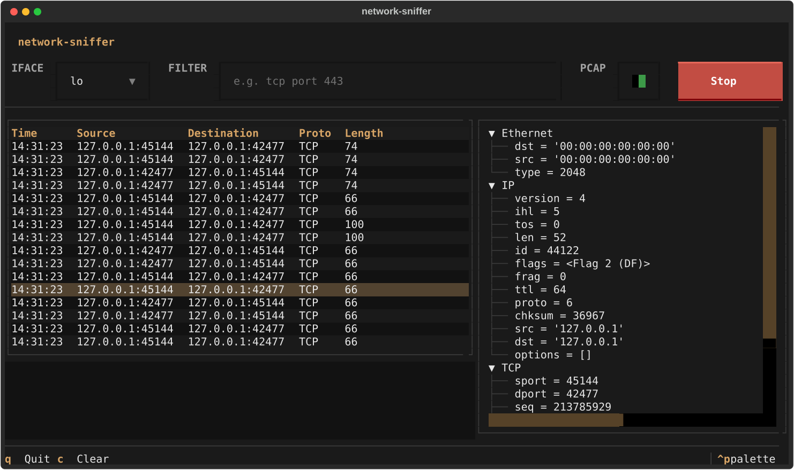

# network-sniffer

TUI network packet sniffer.



## Why

Gives you Wireshark-grade packet inspection (live capture, full per-layer
dissection, BPF filtering, pcap export) from a single terminal window,
without a GUI or a commercial product. Useful for troubleshooting a machine
over SSH, learning how protocols are actually laid out on the wire, or just
watching what your own traffic looks like without leaving the shell.

## How it works
1. Scapy's `AsyncSniffer` opens a raw socket on the selected interface (or
   all interfaces) and captures frames matching the optional BPF filter, in
   a background thread so the UI never blocks, including while waiting for
   traffic on an idle interface.
2. Each captured packet is walked layer by layer using Scapy's dissection,
   following its actual class chain (`Ether`/`IP`/`TCP`/...), producing a
   summary row (time, source, destination, protocol, length) and a full
   field tree.
3. The summary is pushed into the live table; selecting any row rebuilds the
   detail tree with every layer and field for that exact packet, from
   Ethernet MAC addresses down to TCP flags.
4. If PCAP output is armed, each packet is also written immediately to a
   timestamped `.pcap` file in `captures/`, opened lazily on the first
   packet so toggling it on and off never creates an empty file.
5. Protocol and byte counters update live as packets arrive.

## Installation
Requirements: Python 3.11+, root/administrator privileges (raw sockets need
them on every OS), and [`uv`](https://docs.astral.sh/uv/).

Linux/macOS also need `libpcap` for BPF filters, usually already installed;
otherwise `sudo dnf install libpcap` (Fedora) or `sudo apt install libpcap0.8`
(Debian/Ubuntu).

Windows needs [Npcap](https://npcap.com/) with WinPcap
Compatibility Mode enabled.

```bash
uv tool install git+https://github.com/p4p2r0/network-sniffer
```

Capture needs elevated privileges. `sudo` resets `PATH`, so give it the full
path to the installed binary:

```bash
sudo $(which network-sniffer)
```

## Disclaimer
For educational purposes and authorized security testing only.

## License
This project is licensed under the [MIT License](LICENSE).
